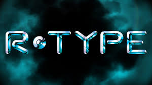
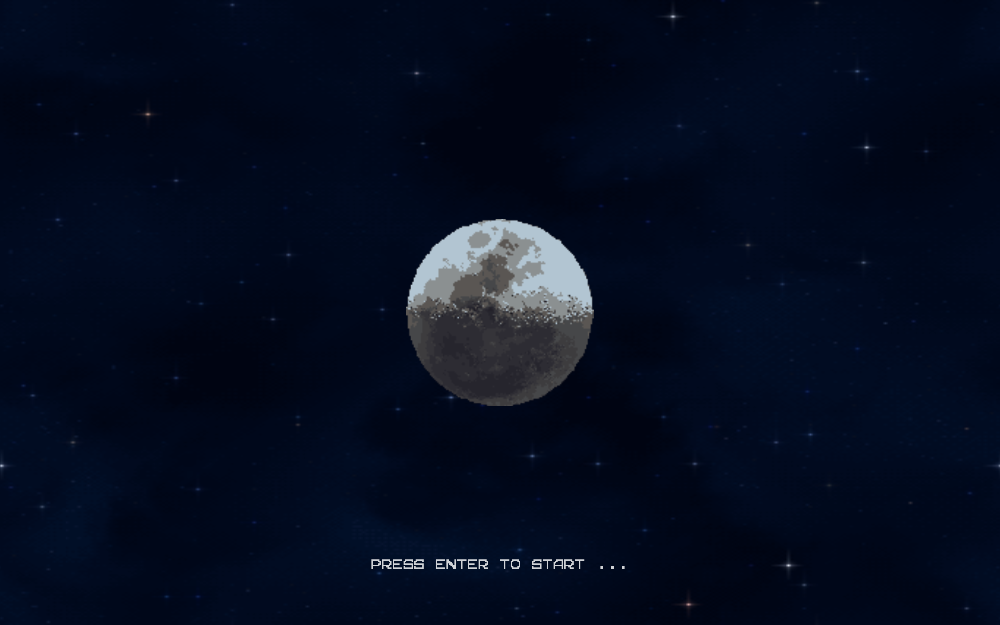
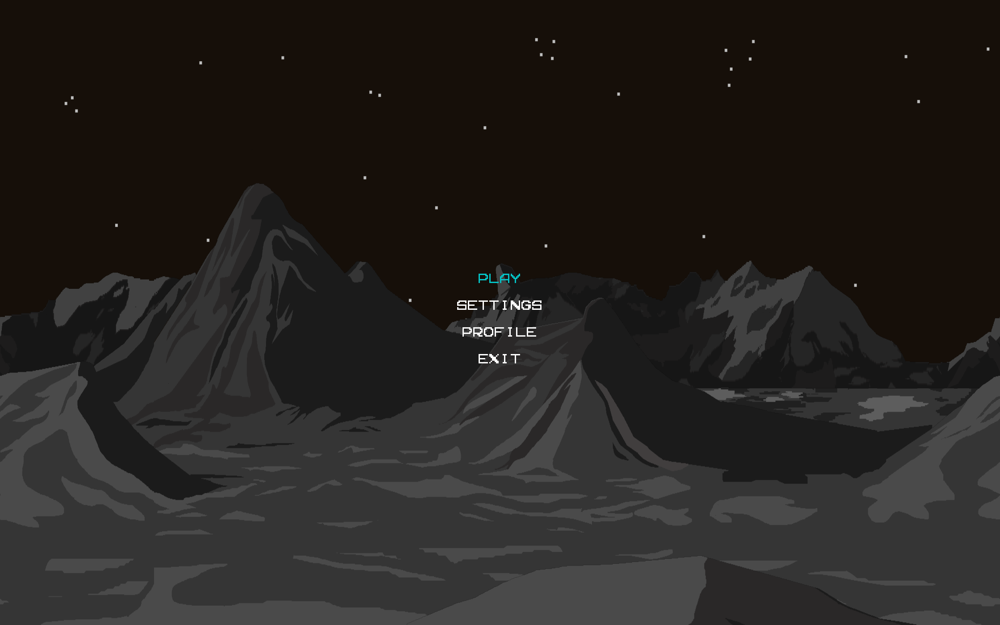

# R-Type



> **A Multi-threaded Game Engine implementation of the legendary 90's Shoot'em'up.**

This project is a networked video game engine developed in C++, designed to recreate the experience of the classic **R-Type**. It features a custom Entity-Component-System (ECS) architecture, allowing multiple players to join forces over a network against the Bydo Empire.

---

## 📖 The Lore

**Blast off against the Bydo Empire!**

R-Type is a classic **Horizontal Shoot'em'up** (Shmup) that defined the genre in the 90s. Set in deep space, humanity is threatened by the evil **Bydos**, a biomechanical alien race bent on destruction.

In this reimagined version, you pilot the R-9 Arrowhead spaceship. Your mission is simple but deadly:

1. Navigate through the scrolling star-fields of space.
2. Survive waves of Bydo slaves and dodge enemy missiles.
3. Confront massive Bosses (like the terrifying Dobkeratops).
4. Utilize your **Force** attachment to shield yourself or unleash devastating attacks.

Unlike the original solo experience, our engine supports **Networked Multiplayer**, allowing a squadron of players to fight the alien threat together.

---

## 📸 Screenshots






### Visual Elements

As per the classic design, our engine handles various entities simultaneously:

- **Player Ships:** Distinctly identifiable for each networked player.
- **Monsters:** Basic enemies and Bydo slaves with unique patterns.
- **Powerups:** Drop from specific enemies to upgrade weapons.
- **Projectiles:** Both enemy and player missiles.
- **Environment:** Destroyable tiles and stage obstacles.
- **Background:** Parallax scrolling star-field.

---

## 🚀 Quick Start

### Prerequisites

- **OS:** Linux (Required), Windows (Supported)
- **Build System:** CMake
- **Dependency Manager:** Conan

### Installation

```bash
# Install Git hooks (format code automatically on commit)
./scripts/install-hooks.sh

# Build the project
./build.sh

# Or manually via CMake/Conan:
conan install . --output-folder=build --build=missing --profile=conan_profile
cmake --preset conan-release
cmake --build build --config Release
```

---

## Usage

Run the server first, then connect with one or more clients.

```bash
# Terminal 1: Launch the Authoritative Server
./build/server/r-type_server

# Terminal 2+: Launch the Graphical Client
./build/client/r-type_client
```

---

## 🛠️ Tech Stack & Architecture

- **Language:** C++20
- **Architecture:** ECS (Entity Component System)
- **Network:** UDP (Game State)
- **Graphics:** SDL2
- **Protocol:** Custom Binary Protocol with capnproto

---

## 📚 Documentation

Detailed documentation is available in the `docs/` folder:

- **Development Setup:** VS Code workflow & tools.
- **Network Protocol:** Binary packet structure RFC.
- **Architecture:** Diagrams of the Server/Client logic.

---

**EPITECH PROJECT © 2025**
