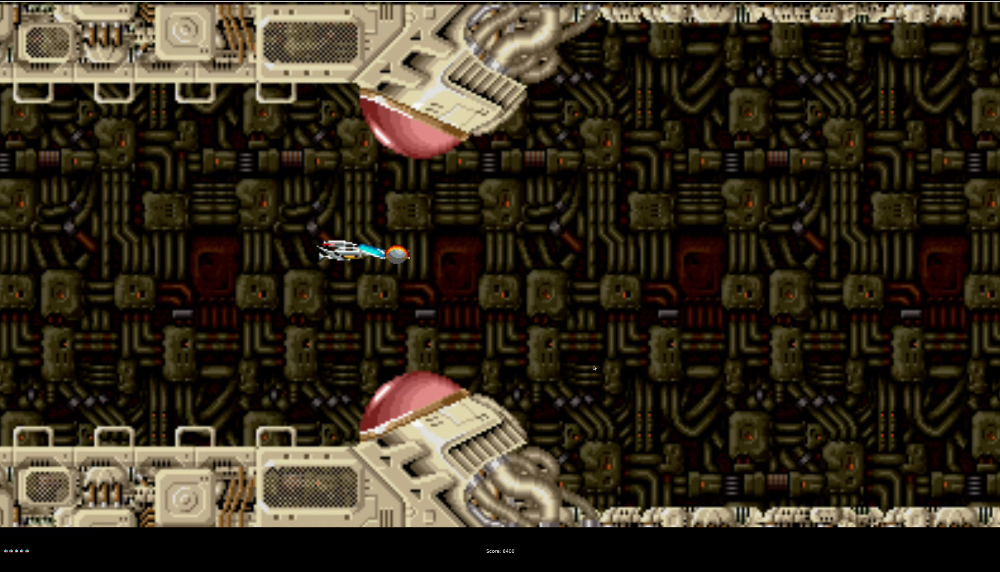

# R-Type


> **A Multi-threaded Game Engine implementation of the legendary 90's Shoot'em'up.**

This project is a networked video game engine developed in C++, designed to recreate the experience of the classic **R-Type**. It features a custom Entity-Component-System (ECS) architecture, allowing multiple players to join forces over a network against the Bydo Empire.

---

## 📖 The Lore

**Blast off against the Bydo Empire!**

R-Type is a classic **Horizontal Shoot'em'up** (Shmup) that defined the genre in the 90s. Set in deep space, humanity is threatened by the evil **Bydos**, a biomechanical alien race bent on destruction.

In this reimagined version, you pilot the R-9 Arrowhead spaceship. Your mission is simple but deadly:

1. Navigate through the scrolling star-fields of space.
2. Survive waves of Bydo slaves and dodge enemy missiles.
3. Confront massive Bosses (like the terrifying Dobkeratops).
4. Utilize your **Force** attachment to shield yourself or unleash devastating attacks.

Unlike the original solo experience, our engine supports **Networked Multiplayer**, allowing a squadron of players to fight the alien threat together.

---

## 📸 Screenshots




### Visual Elements

As per the classic design, our engine handles various entities simultaneously:

- **Player Ships:** Distinctly identifiable for each networked player.
- **Monsters:** Basic enemies and Bydo slaves with unique patterns.
- **Powerups:** Drop from specific enemies to upgrade weapons.
- **Projectiles:** Both enemy and player missiles.
- **Environment:** Destroyable tiles and stage obstacles.
- **Background:** Parallax scrolling star-field.

---

## 🚀 Quick Start

### Linux/macOS
### Prerequisites

- **OS:** Linux (Required), Windows (Supported)
- **Build System:** CMake
- **Dependency Manager:** Conan

### Installation

```bash
# Install Git hooks (format code automatically on commit)
./scripts/install-hooks.sh

# Build the project
./build.sh

# Or manually via CMake/Conan:
conan install . --output-folder=build --build=missing --profile=conan_profile
cmake --preset conan-release
cmake --build build --config Release
```

---

## Usage

Run the server first, then connect with one or more clients.

```bash
# Terminal 1: Launch the Authoritative Server
./build/server/r-type_server

# Terminal 2+: Launch the Graphical Client
./build/client/r-type_client
```

### Windows (MSVC)

```powershell
# Install dependencies with Conan
python -m conans.conan install . --output-folder=build --build=missing -s build_type=Release

# Configure with CMake (uses Visual Studio generator by default)
cmake --preset conan-default

# Build
cmake --build build --config Release

# Copy required DLL next to client executable
Copy-Item -Path "build\libs\Release\sdl2_module.dll" -Destination "build\client\Release\" -Force

# Run (from project root)
.\build\server\Release\server.exe
.\build\client\Release\client.exe
```

## 📚 Documentation

Complete documentation is available in the `docs/` folder. Here's where to start:

### 🎮 For Game Developers

**New to the engine?** Start here:
1. **[Créer un Nouveau Jeu](docs/guides/Creating-A-Game.md)** ⭐ **BEGIN HERE**
2. **[Comprendre l'ECS](docs/technical/ECS-Engine.md)** - Entity-Component-System concepts
3. **[Composants](docs/guides/Adding-Components.md)** - Data structures
4. **[Systèmes](docs/guides/Creating-Systems.md)** - Game logic
5. **[Code Examples](docs/guides/Code-Examples.md)** - 5 complete working examples

### 📖 All Documentation

- **[Documentation Index](docs/INDEX.md)** - Complete index & search
- **[Architecture](docs/ARCHITECTURE.md)** - Project structure
- **[Best Practices](docs/guides/Architecture-Best-Practices.md)** - Patterns & optimization
- **[Network Protocol](docs/PROTOCOL.md)** - Client-Server communication
- **[Guides](docs/guides/README.md)** - All guides directory

### 🎓 Learning Paths

| Path | Duration | For |
|------|----------|-----|
| [Simple 2D Game](docs/guides/Creating-A-Game.md) | 2-3 days | Beginners |
| [ECS Expert](docs/technical/ECS-Engine.md) | 1 week | Intermediate |
| [Multiplayer](docs/guides/Architecture-Best-Practices.md#client-vs-serveur) | 1-2 weeks | Advanced |

### 🛠️ Technology Stack

| Component | Technology |
|-----------|-----------|
| **Language** | C++20 |
| **Architecture** | ECS (Entity Component System) |
| **Network** | ASIO (Async I/O) |
| **Graphics** | SDL2 |
| **Protocol** | Custom binary (Cap'n Proto) |
| **Build** | CMake + Conan |

### ✅ Compiler Support

- **Linux**: GCC 10+, Clang 12+
- **Windows**: MSVC 2019+ (Visual Studio 2019/2022)
- **macOS**: Clang 12+ (Xcode 13+)

### 🔧 Cross-Platform Features

- ✅ **Multithreading:** `std::thread`, `std::mutex`, `std::atomic`
- ✅ **Networking:** ASIO (no raw sockets, no POSIX dependencies)
- ✅ **Graphics:** SDL2 (cross-platform windowing & rendering)
- ✅ **Build System:** CMake with MSVC and GCC/Clang support

---

**EPITECH PROJECT © 2025**
